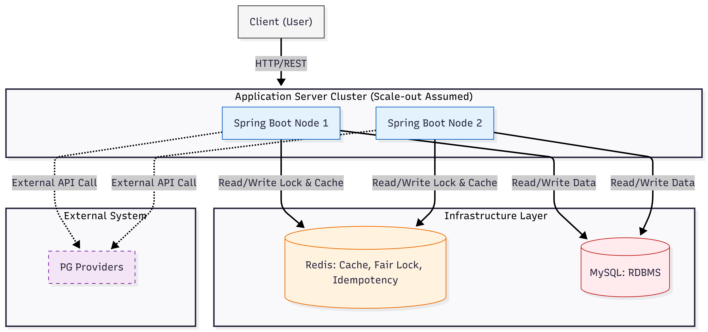
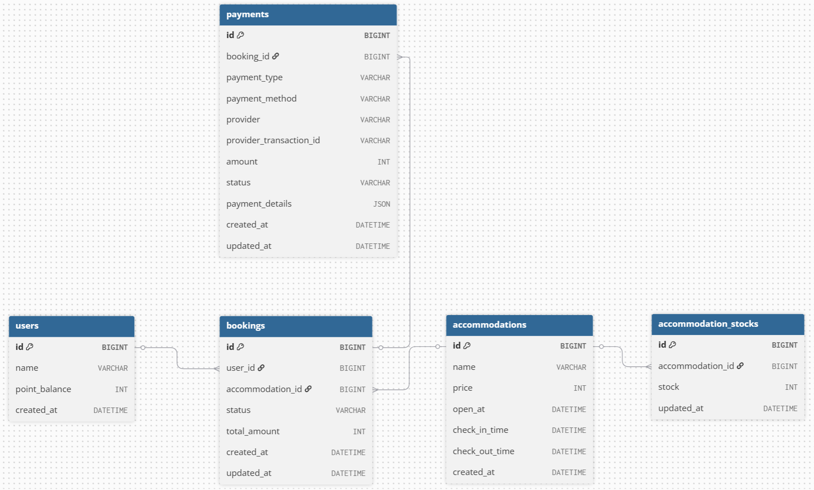
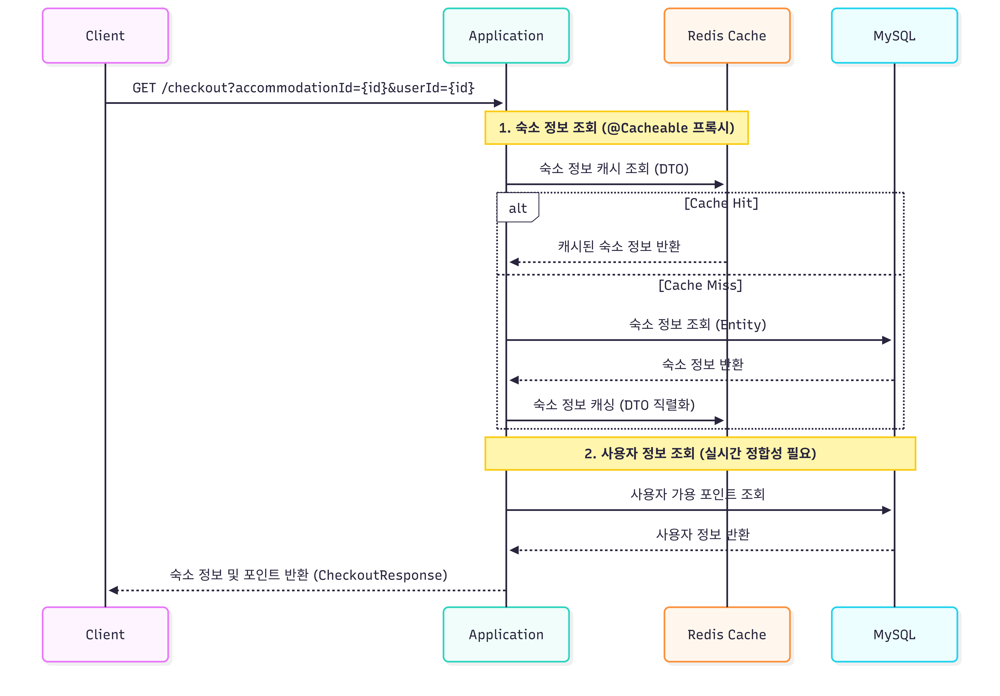

# 초특가 숙소 선착순 예약 시스템

## 프로젝트 개요
**특정 시간(00시)에 오픈되는 10개 한정 초특가 숙소 상품**에 대해, **대규모 트래픽(순간 TPS 1000 이상)이 몰리는 상황에서도 정합성, 공정성, 고가용성을 보장하는 선착순 예약 시스템**입니다.

---

## 시스템 아키텍처
> 본 시스템은 **2대 이상의 애플리케이션 서버로 구성된 분산 환경**을 가정하여 구현하였습니다.



### 기술 스택
- **Language:** Java 17
- **Framework:** Spring Boot 3.5.14
- **Database:** MySQL 8.0.46
- **Cache & Lock:** Redis 8.6.2 (Redisson 3.31.0)
- **Infrastructure:** Docker, Docker Compose

### 프로젝트 구조
```
flash-sale-booking/
├── images/                  # [Docs] README에 첨부된 다이어그램 및 이미지 파일
├── src/main/java/com/flashsale/booking/
│   ├── application/
│   │   ├── facade/          # [Orchestration] 분산 락 및 서비스 간 로직 조율
│   │   └── service/         # [Business] 비즈니스 오케스트레이션 로직
│   ├── domain/              
│   │   ├── accommodation/   # [Domain] 숙소 및 재고 도메인
│   │   ├── booking/         # [Domain] 예약 도메인
│   │   ├── payment/         # [Domain] 결제 도메인 (전략 패턴 구현체 포함)
│   │   └── user/            # [Domain] 사용자 도메인
│   ├── global/              
│   │   ├── annotation/      # [Global] 커스텀 어노테이션 (@DistributedLock 등)
│   │   ├── aop/             # [Global] 분산 락 처리를 위한 Aspect
│   │   ├── common/          # [Global] ApiResponse, BaseTimeEntity 등 공통 기반 클래스
│   │   ├── exception/       # [Global] 비즈니스 예외 및 전역 예외 핸들러
│   │   └── utils/           # [Global] SpringELParser 등 동적 키 파싱을 위한 유틸리티
│   ├── infrastructure/
│   │   └── redis/           # [Infra] Redis, Redisson 클라이언트 설정
│   └── BookingApplication   # [Main] 애플리케이션 진입점
├── src/main/resources/
│   ├── application.yml      # [Config] 시스템 환경 설정
│   └── data.sql             # [Data] 초기 데이터 시딩 스크립트
├── Dockerfile               # [Ops] 애플리케이션 이미지 빌드 설정
├── docker-compose.yml       # [Ops] 전체 인프라 통합 실행 환경 설정
├── README.md                # [Docs] 프로젝트 소개
└── DECISIONS.md             # [Docs] 기술적 의사결정 및 쟁점 해결 기록
```

---

## 프로젝트 실행 방법 (Docker 기반)
> **본 프로젝트는 로컬 환경에 별도의 인프라 설치 없이, 단일 명령어로 즉시 구동 가능한 통합 도커 환경을 제공**합니다.

### 1. 요구 사항
- Docker 및 Docker Compose가 설치되어 있어야 합니다.
- 호스트의 `8080`, `3306`, `6379` 포트가 비어있어야 합니다.

### 2. 실행 명령어
```bash
# 전체 시스템(App, MySQL, Redis) 백그라운드 빌드 및 구동
docker-compose up -d --build
```
- 구동 후 MySQL과 Redis가 준비되는 데 약 10~15초 정도 소요될 수 있으며, 이후 **`http://localhost:8080`을 통해 API에 접근**할 수 있습니다.
- 만약 애플리케이션 서버를 로컬 환경에서 구동하고 싶은 경우, `docker-compose up -d mysql-db redis` 명령어를 실행하면 됩니다.

---

## ERD


---

## API 목록

| Domain | Method | Endpoint | Description | Note |
| :--- | :---: | :--- | :--- | :--- |
| **Accommodation** | `GET` | `/api/accommodations` | 숙소 목록 조회 | 전체 숙소 리스트 반환 |
| **Accommodation** | `GET` | `/api/accommodations/{id}` | 숙소 단건 조회 | 특정 숙소의 상세 정보 반환 |
| **Order** | `GET` | `/api/checkout` | [필수] 주문서 진입 | 숙소 정보(Cache) 및 사용자 포인트 동시 조회 |
| **Order** | `POST` | `/api/booking` | [필수] 결제 및 예약 완료 | 분산 락 기반 선착순 예약 및 멱등성 처리 |

### 1. 숙소 목록 조회
#### Request
- **요청 URL:** `/api/v1/accommodations`

#### Response
```json
{
    "success": true,
    "data": [
        {
            "id": 1,
            "name": "초특가 제주 호캉스 패키지",
            "price": 50000,
            "openAt": "2026-05-06T13:11:03",
            "checkInTime": "2026-05-14T13:11:03",
            "checkOutTime": "2026-05-16T13:11:03"
        },
        {
            "id": 2,
            "name": "부산 해운대 오션뷰 스위트",
            "price": 80000,
            "openAt": "2026-05-08T13:11:03",
            "checkInTime": "2026-05-21T13:11:03",
            "checkOutTime": "2026-05-23T13:11:03"
        }
    ],
    "message": "요청 성공"
}
```

### 2. 숙소 단건 조회
#### Request
- **요청 URL:** `/api/v1/accommodations/1`

#### Response
```json
{
    "success": true,
    "data": {
        "id": 1,
        "name": "초특가 제주 호캉스 패키지",
        "price": 50000,
        "openAt": "2026-05-06T13:11:03",
        "checkInTime": "2026-05-14T13:11:03",
        "checkOutTime": "2026-05-16T13:11:03"
    },
    "message": "요청 성공"
}
```

### 3. 주문서 진입
#### Request
- **요청 URL:** `/api/v1/bookings/checkout?userId=1&accommodationId=1`

#### Response
```json
{
    "success": true,
    "data": {
        "accommodationId": 1,
        "accommodationName": "초특가 제주 호캉스 패키지",
        "totalAmount": 50000,
        "userId": 1,
        "pointBalance": 100000
    },
    "message": "요청 성공"
}
```

### 4. 결제 및 예약 완료
#### Request
- **요청 URL:** `/api/v1/bookings/checkout?userId=1&accommodationId=1`
- **요청 메시지 바디:**
    ```json
    {
      "userId": 1,
      "accommodationId": 1,
      "payMethods": [
        {
          "paymentMethod": "Y_POINT",
          "provider": "SYSTEM",
          "amount": 30000
        },
        {
          "paymentMethod": "CREDIT_CARD",
          "provider": "Y",
          "amount": 20000
        }
      ]
    } 
    ```

#### Response
```json
{
    "success": true,
    "data": 1,
    "message": "요청 성공"
}
```

---

## 시퀀스 다이어그램 (비즈니스 로직 흐름)
### 1. 주문서 진입 API (GET /checkout)


### 2. 결제 및 예약 완료 API (POST /booking)
